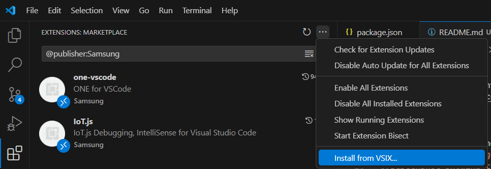

# CAS Extensions

This is a monorepo containing official
[CAS](https://github.com/Samsung/CAS)-related extensions and their components.

## Installation

Currently the recommended way of installing the extensions is downloading them
from the [Releases page](../../releases) and installing them manually:



You can also use a command:


## Usage

Currently there are two extensions included:
[main CAS extension](extensions/cas) and [cas-p4](extensions/p4) which adds
support for downloading perforce-based workspaces.

### CAS Server usage

The extension supports CAS-server based functionality, including:
- CAS database client
  - includes ability to define custom command shortcuts (created via save icon in database view, delete via right click on shortcut)
- Process tree
  - equivalent of [process tree in CAS clien/server](https://github.sec.samsung.net/CO7-SRPOL-Mobile-Security/CAS-OSS/tree/master/client#process-tree-dependency-tree-and-reversed-dependencies-tree)
- Dependency tree
   - list of module dependencies from BAS
- file information from BAS
  - original path, access, whether file was compiled or linked, etc.
  - accessible in explorer via both file decoration (color indicating type of file and letter for access) and a separate BAS File Information tab
  - additionally right click context menu includes options for some queries specific to the selected file
- Flame Graph visualization
  - Interactive visualization of process execution times to identify build bottlenecks
  - Process Timing Graph shows temporal distribution of child processes across threads

### Workspaces

- Allows for generation of VSCode workspaces from BAS data, including dependency tree or any command that returns a list of files
- includes several ways of getting sources into the generated workspace:
  - local files (meant for working on the same device the database was generated on)
  - sftp
  - perforce (requires installation of cas-p4 plugin)
> [!NOTE]
> workspace generators other than `local` require a manifest setup
- supports updating the workspaces to add or remove files

### Workspace Manifest setup

- supports importing settings from pregenerated (or written) `.code-workspace` VSCode workspace files
  - workspaces can be generated by CAS client, see `cas vscode --help` (or [mod_ide.py](https://github.sec.samsung.net/CO7-SRPOL-Mobile-Security/CAS-OSS/blob/master/client/mod_ide.py) directly) for arguments
  - can also be generated as part of a build pipeline
  - fairly simple to write manually, see [the manifest format documentation](./docs/manifest.md) for more details on how they're structured
- manifests can also define a remote workspace that VSCode will connect to (vis SSH Remote extension)

### OpenGrok
- search window
- providing language features in files, including:
  - [go to definition](https://code.visualstudio.com/docs/editor/editingevolved#_go-to-definition)
  - [go to symbol](https://code.visualstudio.com/docs/editor/editingevolved#_go-to-symbol)
  - [find reference](https://code.visualstudio.com/docs/editor/editingevolved#_peek)

> [!NOTE]
> using OpenGrok features requires an API key for authentication, even if the rest of the OG instance is not authenticated/behind other kind of auth (e.g. HTTP Basic auth)

### Self-installation and self-update

Please not that due this plugin needing to work server-side and promoting working remotely via SSH, there is a self-installation feature that will, by default, have the plugin automatically install (and update) itself on all servers your VSCode instance connects to. You can disable this behavior by disabling the `cas.selfUpdateEnabled` setting.

This is accomplished using a separate `CAS Updater` plugin that is automatically installed by the main CAS plugin. It will also uninstall itself when you uninstall the main CAS plugin, so it doesn't require any additional cleanup.

## Development

### Installing dependencies

This repository uses [pnpm](https://pnpm.io/) - to install it you can use
[any of the methods in their installation documentation](https://pnpm.io/installation),
but in most cases the easiest way to do so will be enabling
[corepack](https://nodejs.org/api/corepack.html#enabling-the-feature) via a
simple `corepack enable`. Afterwards `pnpm` should be available in PATH.

Once you have `pnpm` simply run

```bash
pnpm install
```

to install all dependencies in the monorepo.

### Repository structure

This monorepo is divided into two main package sources - `extensions` for all
packages that ultimately result in an extension `vsix` file and `packages` for
everything else.

Currently there are two extensions included:

- [CAS](extensions/cas): the "main" extension containing most of the relevant
  featues
- [CAS-P4](extensions/p4): support for Perforce-based workspaces generated via
  the [CAS extension](extensions/cas)

### Debugging

The easiest way to check and debug the extensions is by using one of the
included VSCode launch configurations:


The default configuration preferred for most use cases is Run Extensions, as it
will allow for simultaincously debugging all included extensions.

The base configurations are compiled for development and use a development
server for webview instead of fully built pages. This allows for shorter build
times and more immediate feedback - especially on webviews where HMR is used to
live-reload changes (though note that due to specifics of VSCode's webviews this
can sometimes be buggy and require a reload).

You should be able to use the standard VSCode debugger in both "extension-side"
and "client-side" (webview) code.

### Building and running scripts

There are two options for running scripts across the monorepo - native pnpm
capabilities and turborepo. By default pnpm scripts at the root actually call
turborepo, to allow for local caching of script results.

The main scripts you might want to run yourself are:

- `package:extensions` builds the production code for each extension and
- `build:clangd` builds the clangd binary for use in c/cpp specific features, like improved macro expansion. It's optional, takes a fairly long time (requires downloading LLVM and building clang) and should generally only be required once, with very occasional updates as clangd version is updated. Run before `package:extensions`
  packages it into `vsix` files
- `build` for just testing the build step
- `check` for typechecking via tsc
- `lint` and `lint:fix` for linting and formatting using Biome

#### Full installation and build process

The initial build, after cloning the repository, should look something like this:
```bash
pnpm install
pnpm build:clangd
pnpm package:extensions
```

You will then be able to find the generated `.vsix` files in the `dist` directory. To install them follow the [Installation](#installation) documentation above, simply skipping the download part, or use any other method described in [VSCode Extensions Documentation](https://code.visualstudio.com/docs/configure/extensions/extension-marketplace#_install-from-a-vsix)

After modifying some code or updating the repository, run `pnpm install` again if any dependencies changed and then just run
```bash
pnpm package:extensions
```
To build new versions of `.vsix` files


### Linting and formatting

This repository uses [Biome](https://biomejs.dev/) for both formatting and
linting. The `lint` and `lint:fix` scripts at the root allow for quickly
checking and automatically fixing both of these issues.

In most cases running them manually shouldn't be needed, as upon dependency
installation [lefthook](https://github.com/evilmartians/lefthook) should set up
a git pre-commit hook for running Biome on commited files.

### Tests

Currently there are no automated tests included. Their addition is tracked under
#37. For now manual testing via the VSCode UI is recommended. The
`Run Extensions (production)` launch configuration is recocmmended for that
purpose.

### Updating dependencies

Please note that dependencies shared across packages should be managed via
[catalogs](https://pnpm.io/catalogs) in
[pnpm-workspace.yaml](pnpm-workspace.yaml) with their version in relevant
`package.json` files set to just `catalog:`.

Other dependencies can be managed per-package.

For updating dependencies to latest versions `pnpm -r update -i -L` is
recommended - this allows for interactively (`-i`) selecting which dependencies
to upgrade (including across major versions - remove `-L` to only work within
semver ranges) across the workspace (`-r` for `--recursive`)

### CI and commiting

There are currently 3 GitHub Actions set up in this repository. They primarily
realize the following:

- building the extensions and uploading the resulting artifacts
  - the workflow should leave a comment with a link to that artifact on every
    Pull Request
- checking linting and formatting, and providing feedback on that in Pull
  Requests
  - thanks to [reviewdog](https://github.com/reviewdog/reviewdog) the feedback
    should take a form of actionable code comments on Pull Requests
- automating the release process via release-please

The last part creates a few best practices that should allow for a simpler
release process, primarily:

- please try to use the
  [Conventional Commits](https://www.conventionalcommits.org/en/v1.0.0/) style
  for at least the final squashed commit title. This allows for simple changelog
  generation.
- selecting "squash" for the pull request merge strategy
  - this linearizes the git commit history and avoids polluting it with merge
    commits, while giving you opportunity to create the aformentioned
    Conventional Commit title. If you wish to include multiple commits from one
    PR in the changelog
    [it's possible to do via commit footers](https://github.com/googleapis/release-please/tree/main?tab=readme-ov-file#what-if-my-pr-contains-multiple-fixes-or-features)
  - note that squahing and the resulting commit message are primarily the
    maintainer's responsibility and aren't in any way a hard requirement for
    contibution
